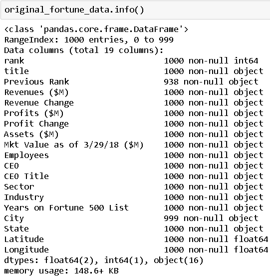
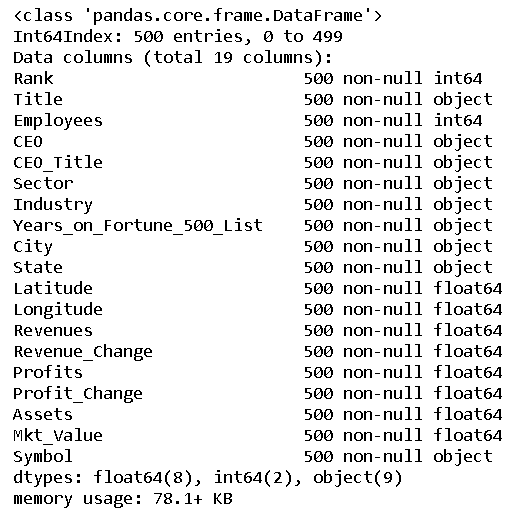
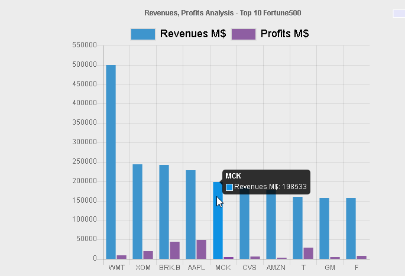
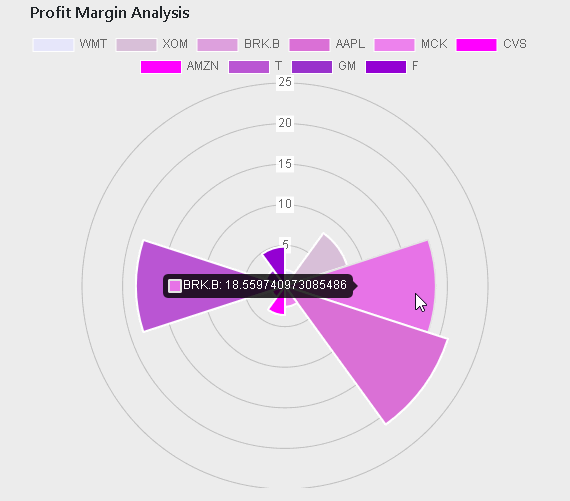
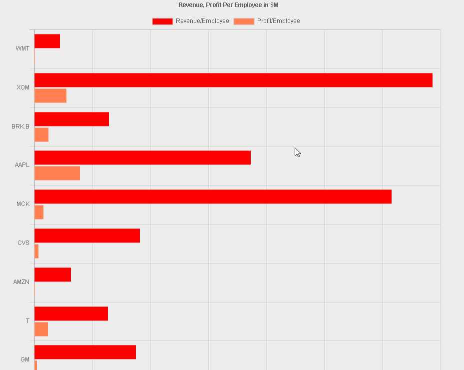
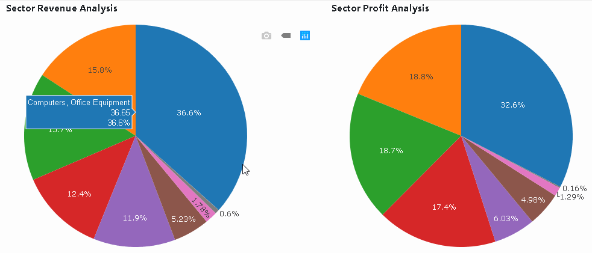
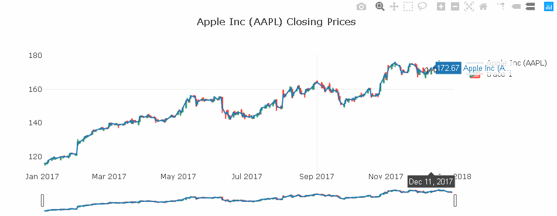
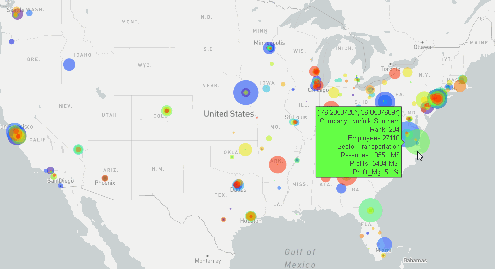

## Data Visualization project.

## US Fortune 500 Financial Data Analysis.

## Background

In this project, we have created a web application using Flask, Python, PostgreSQL  and different JavaScript libraries to render various visualizations and interactive charts, that would allow individuals visiting our website the opportunity to analyze US Fortune 500 companies, their stock price, and the financials associated with them. We hope that our website arms potential investors with the data they need to make financial investment decisions.

#### Following analysis are done.

  - Are companies making bigger revenue makes bigger profits? Correlation between Revenue Vs Profit and Profit Margin (Top 10 Fortune 500)
  - Correlation between Per employee Revenue and Profit. ((Top 10 Fortune 500))
  - Findinging the profit margin (  Profit / Revenue). (Top 10 Fortune 500)
  - Percentage of revenue and profit of each industry per sector.
  - Stock trend /correlation analysis.
  - Using map to represent all Fortune 500 companies and their key financial data.

  ## Tasks
  ### Extract / Transform / Load

  #### Extract
  
  We have used Fortune 1000 dataset from [Kaggle](https://www.kaggle.com/Eruditepanda/fortune-1000-2018) to perform the analysis.

  ### Transform

  We decided to extract first 500 records only based on ranking and then using S&P dataset from [DataPub](https://datahub.io/core/s-and-p-500-companies), updated the dataset with stock ticker info so that stock analysis can also be performed. Also performed cleaning and transforming like removing null values, converting string objects to float objects etc..

  Also created an new table for storing the aggregated data of revenue and profit percentages per sector for all industries.

  **Original Data Schema**
   
  

  **New Data Schema**
  
  
  

  ### Load

  **PostgreSQL tables created**

  _[SQL Schema](fortune500/misc/Scripts/schema.sql)_ for schema creation.

  ### Charts/Visualization

  **Languages/Libraries used**

  _Flask, Python, JavaScript, D3.js, Plotly, Chart.js, JQuery_

  1. Revenue / Profit Analysis ( Top 10 Fortune 500 Companies)

  

  

  2. Revenue / Profit Analysis Per employee ( Top 10 Fortune 500 Companies)

  

  3. Sector Analysis

  

  4. Stock Trend Analysis

  

  5. Map of US with all Fortune 500 companies and their financial data.

  

  ### Resources

  [Kaggle](https://www.kaggle.com/Eruditepanda/fortune-1000-2018)

  [Quandl](https://www.quandl.com/)

  [DataPub](https://datahub.io/core/s-and-p-500-companies)

  ### How to use this app.

  1. Clone this repo.

  2. Change to project folder _cd group2_project_

  2. Update _\config.py_  with your Quandl API key and postgres local username and password.

  3. Update _fortune500\static\js\config.js_ with your Quandl API key and Mapbox API Key.

  4. Run _python fortune500\app.py_
 

  

  
  

  

  

